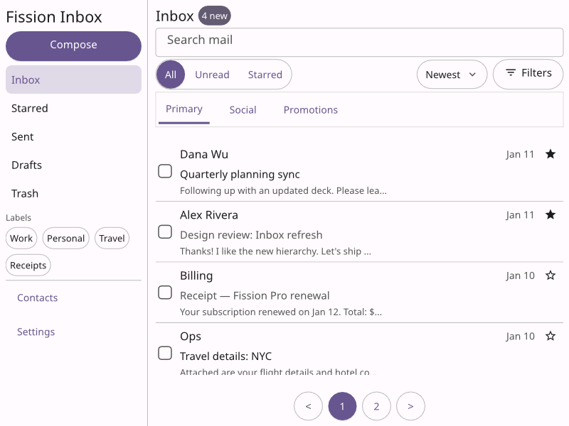
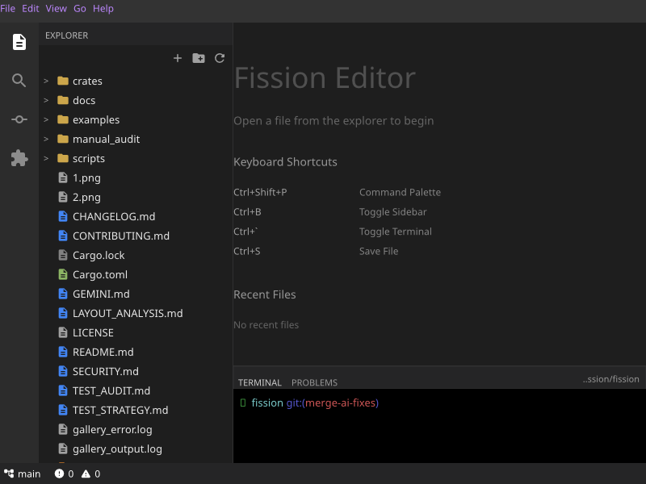
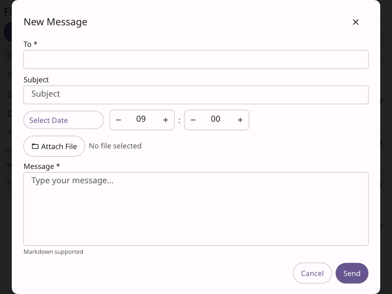
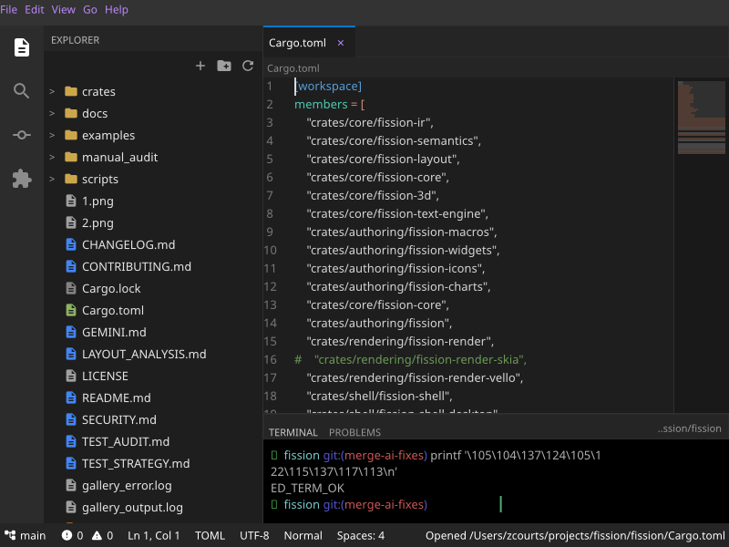
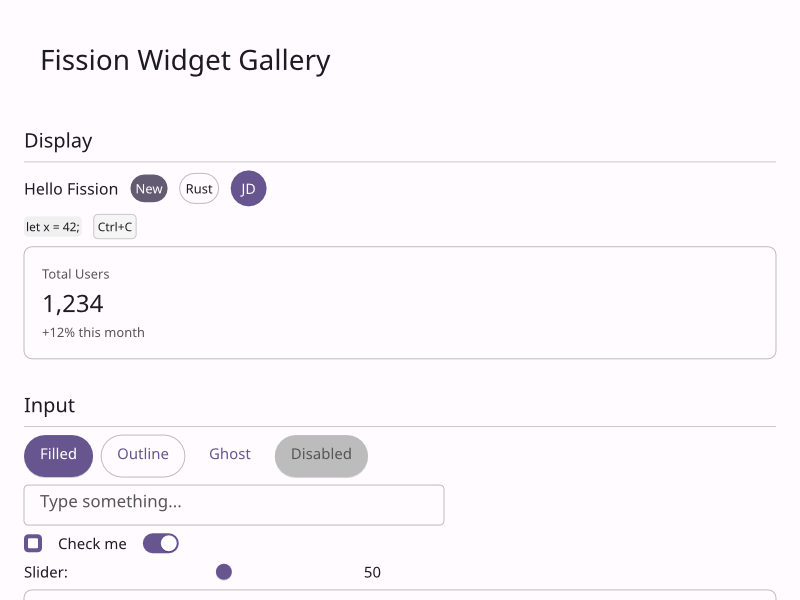
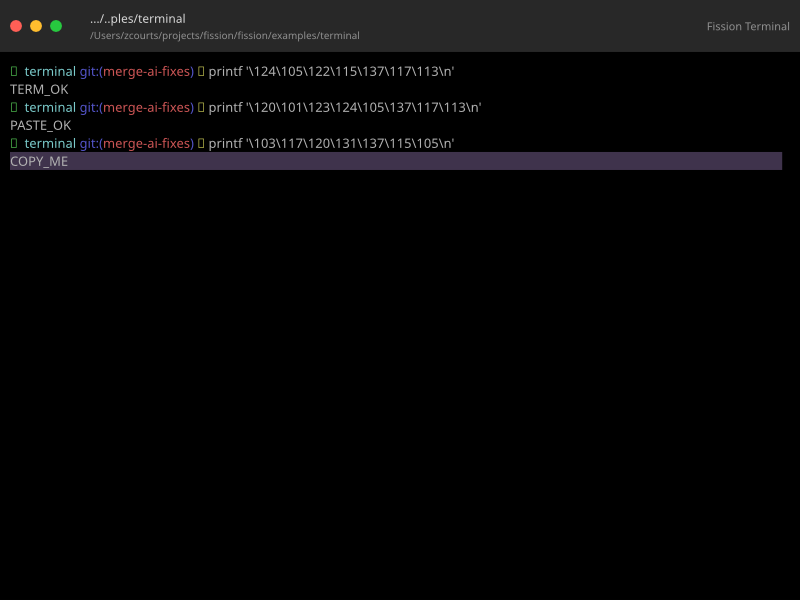

# Fission

[](https://crates.io/crates/fission)
[](https://fission.rs)
[](LICENSE)
[](https://github.com/fission-ui/fission/actions/workflows/platform-checks.yml)

Fission is a production-focused Rust application framework for building GPU-accelerated apps across macOS, Windows, Linux, Web, Android, iOS, Terminal, Static site, and SSR targets.

It gives you the application model, widgets, rendering pipeline, platform shells, testing tools, packaging, and release workflows needed to move from a first screen to a shipped product without stitching together a new toolchain for every target.

**Documentation:** [fission.rs](https://fission.rs)<br>
**Repository:** [github.com/fission-ui/fission](https://github.com/fission-ui/fission)

---

## Why Fission

Most application projects need more than a widget library. They need a way to create the app, run it on real devices, test it, package it, publish it, and keep the developer workflow understandable as the project grows.

Fission is built around that full lifecycle:

| Stage | What Fission provides |
| --- | --- |
| Setup | `fission init`, target scaffolding, setup checks, project manifests, and platform notes. |
| Learn | A guided documentation site, cookbook pages, reference pages, and examples that use the same public API as applications. |
| Build | Declarative widgets, typed actions and reducers, design systems, charts, media/embed widgets, 3D scenes, Terminal, Static site rendering, and SSR. |
| Test | Unit tests, widget tests, live app tests, device/simulator smoke paths, diagnostics, static route/link checks, and server route checks. |
| Publish | Package outputs, readiness checks, release content validation, GitHub Pages, GitHub Releases, cloud/static providers, and store distribution flows. |

The result is one Rust-first workflow that scales from a counter app to a multi-platform product.

---

## See It

These screenshots come from checked-in Fission examples and the Fission documentation site assets. They show the same widget model handling product screens, text editing, developer tools, widget reference work, and data visualization.

<table>
  <tr>
    <td width="50%"><br><strong>Inbox</strong></td>
    <td width="50%"><br><strong>Editor</strong></td>
  </tr>
  <tr>
    <td><br><strong>Compose flow</strong></td>
    <td><br><strong>Integrated terminal</strong></td>
  </tr>
  <tr>
    <td><br><strong>Widget gallery</strong></td>
    <td><br><strong>Terminal</strong></td>
  </tr>
  <tr>
    <td><br><strong>Charts</strong></td>
    <td><br><strong>3D and globe charts</strong></td>
  </tr>
</table>

Explore the generated documentation site at [fission.rs](https://fission.rs), or run it locally:

```sh
cargo run -p cargo-fission --bin fission -- site serve --project-dir documentation
```

---

## Quick Start

Install Rust first if you do not already have it: [rustup.rs](https://rustup.rs).

Install the Fission command:

```sh
cargo install cargo-fission
```

That installs the single `fission` command used for setup, running, testing, packaging, site generation, and publishing.

Create and run a new app:

```sh
fission init my-app
cd my-app
fission run
```

Add more targets when you need them:

```sh
fission add-target web android ios
fission devices
fission run --target web
fission run --target android --device <device-id>
fission run --target ios --device <simulator-id>
```

Run the terminal UI for the developer tool itself:

```sh
fission ui
```

---

## A Small Fission App

Fission apps are ordinary Rust. State is explicit, actions are typed, reducers update local or global state, and components convert into a closed widget tree value.

```rust
use fission::prelude::*;

#[fission_component]
struct CounterApp {
    #[local_state(default = 0)]
    count: i32,
}

#[fission_reducer(Increment)]
fn increment(count: &mut i32) {
    *count += 1;
}

impl From<CounterApp> for Widget {
    fn from(counter: CounterApp) -> Widget {
        let (ctx, _) = fission::build::current::<()>();
        let count = counter.count();
        let increment = ctx.bind_local(Increment, count.clone(), reduce!(increment));

        Container::new(Column {
            gap: Some(20.0),
            children: widgets![
                Text::new("Counter").size(32.0),
                Text::new(format!("{}", count.get())).size(56.0),
                Button {
                    on_press: Some(increment),
                    child: Some(Text::new("Increment").into()),
                    ..Default::default()
                },
            ],
            ..Default::default()
        })
        .padding_all(32.0)
        .into()
    }
}

fn main() -> anyhow::Result<()> {
    DesktopApp::<(), _>::new(CounterApp {}).run()
}
```

Use `#[fission_reducer]` for compact local actions, or `#[fission_action]` when you want a named action type that is shared across modules or documented as part of your app API.

---

## What You Get Out Of The Box

<details open>
<summary><strong>Application framework</strong></summary>

- Struct-based widget composition in Rust, with normal types implementing `From<T> for Widget`.
- Typed application state, typed actions, reducers, selectors, effects, and explicit environment data.
- GPU-accelerated rendering through the Fission rendering stack.
- Layout, text input, input events, accessibility semantics, portals, overlays, animation support, media/embed widgets, and 3D support.
- Design-system support from Design System Package JSON at build time, including generated themes and bundled presets for Fission, Material Design 3, Fluent 2, Liquid Glass, and Cupertino-style apps.

</details>

<details open>
<summary><strong>Targets and shells</strong></summary>

- macOS, Windows, and Linux native apps through the desktop shell.
- Web apps compiled to WebAssembly and hosted in the browser.
- Android and iOS apps through mobile host projects, emulator/simulator workflows, and device validation.
- Terminal user interfaces built from Fission widgets and reducers.
- Static sites generated from custom widget routes plus Markdown/MDX content routes.
- SSR apps for request-time HTML, sessions, signed actions, jobs, cache policy, workers, and islands.

</details>

<details open>
<summary><strong>Built-in product features</strong></summary>

- A broad widget catalog for layout, text, buttons, forms, navigation, cards, overlays, media, and embeds.
- Fission Charts for dashboards and data-heavy applications.
- Platform capabilities for notifications, deep links, NFC, biometrics, passkeys, barcode scanning, camera, clipboard, geolocation, haptics, microphone, Bluetooth, Wi-Fi, and volume control where the host platform supports them.
- Static-site features including sidebars, table-of-contents links, favicons, generated CSS, optional code highlighting, client-side search, sitemap, robots output, JSON-LD, route-filtered page elements, and internal-link validation.
- Server-site features including route modes, session-private state, signed actions, server jobs, cache policy, Docker packaging, progressive workers, and focused islands.

</details>

<details open>
<summary><strong>Developer workflow</strong></summary>

- `fission init` for new and existing projects.
- `fission add-target` for platform support files.
- `fission devices` and `fission run` for attached local development.
- `fission doctor` and readiness checks for actionable setup diagnostics.
- `fission package`, `fission release-content`, and `fission distribute` for production artifacts and release flows.

</details>

---

## Platform Status

| Target | Shell family | Entry point |
| --- | --- | --- |
| macOS | Desktop | `fission run --target macos` or `cargo run` |
| Windows | Desktop | `fission run --target windows` |
| Linux | Desktop | `fission run --target linux` or `cargo run` |
| Web | Web | `fission run --target web` |
| Android | Mobile | `fission run --target android` |
| iOS | Mobile | `fission run --target ios` |
| Terminal | Terminal | `fission ui` and terminal app crates |
| Static site | Site | `fission site serve --project-dir documentation` |
| SSR | Server | `fission server serve --project-dir examples/pokemon-card-store` |

Some host APIs depend on platform support. The capability matrix in the docs shows where each built-in capability is available and which app-store or platform configuration files are generated.

---

## Examples To Try

```sh
cargo run -p counter
cargo run -p widget-gallery
cargo run -p chart-gallery
cargo run -p animation-gallery
cargo run -p fission-editor
cargo run -p terminal
```

Static site workflow:

```sh
fission site check --project-dir documentation --release
fission site serve --project-dir documentation
fission site build --project-dir documentation --release
```

Packaging and release workflow:

```sh
fission readiness package --project-dir . --target windows --format msix
fission package --project-dir . --target windows --format msix --release
fission release-content validate --project-dir . --provider microsoft-store
fission distribute --project-dir . --provider github-releases --artifact target/fission/release/windows/msix/artifact-manifest.json
```

---

## Repository Layout

| Path | Purpose |
| --- | --- |
| `crates/core` | Core runtime, layout, text, theme, 3D, and IR crates. |
| `crates/authoring` | Public facade crate, widgets, charts, icons, and macros. |
| `crates/shell` | Desktop, Web, Mobile, Terminal, Static site, and SSR shell crates. |
| `crates/tools` | `fission` command modules, diagnostics, credentials, packaging, release, and test tooling. |
| `examples` | Runnable apps that exercise real framework features. |
| `documentation` | The Fission documentation and product site, built by the Fission static site shell. |
| `docs` | RFCs and design documents for deeper implementation work. |

---

## Documentation

Start at [fission.rs](https://fission.rs):

- [Quickstart](https://fission.rs/docs/learn/quickstart/)
- [App structure](https://fission.rs/docs/guides/app-structure/)
- [Widgets and layout](https://fission.rs/docs/guides/layout-and-widgets/)
- [Design systems](https://fission.rs/docs/guides/design-system/)
- [Charts](https://fission.rs/docs/charts/overview/)
- [Platform capabilities](https://fission.rs/docs/guides/platform-capabilities/)
- [Static sites](https://fission.rs/docs/guides/static-sites/)
- [Server-rendered sites](https://fission.rs/docs/guides/server-sites/)
- [Terminal user interfaces](https://fission.rs/docs/guides/terminal-user-interfaces/)
- [Build and package](https://fission.rs/docs/build-and-package/overview/)
- [Release and distribute](https://fission.rs/docs/release-and-distribute/overview/)

---

## Contributing

Fission is MIT licensed and open to practical contributions: bug fixes, tests, documentation, examples, platform hardening, and focused feature work.

Read [CONTRIBUTING.md](CONTRIBUTING.md) before opening larger changes, and keep examples aligned with the style we want application developers to copy.

## License

Fission is available under the [MIT license](LICENSE).
