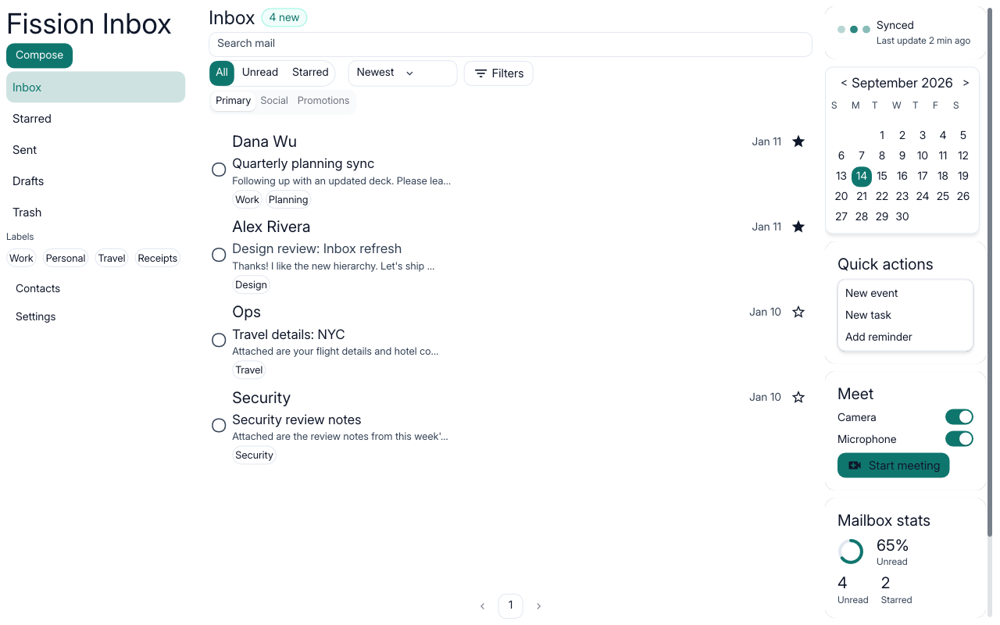
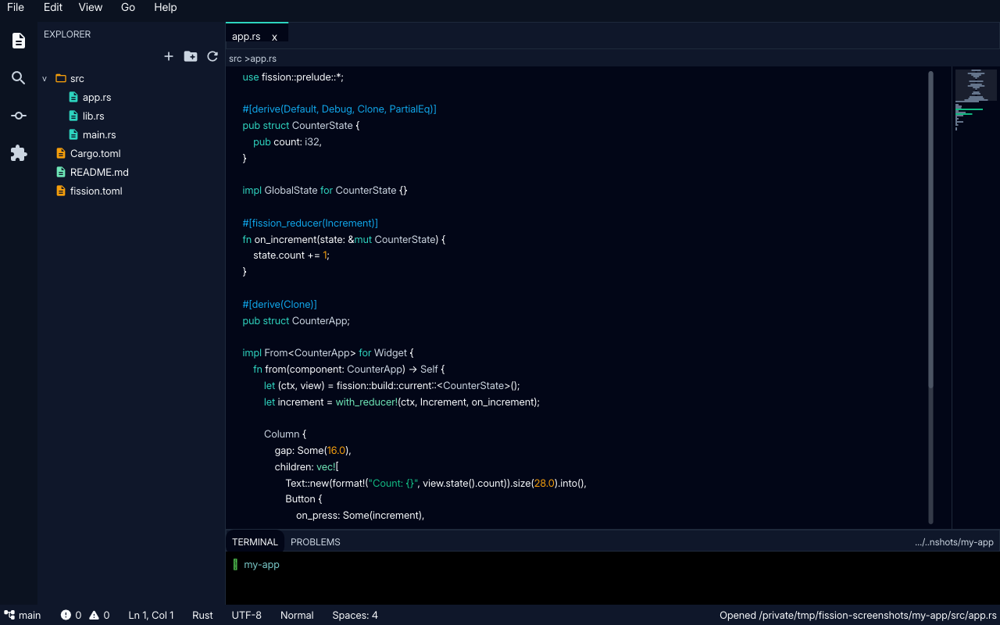
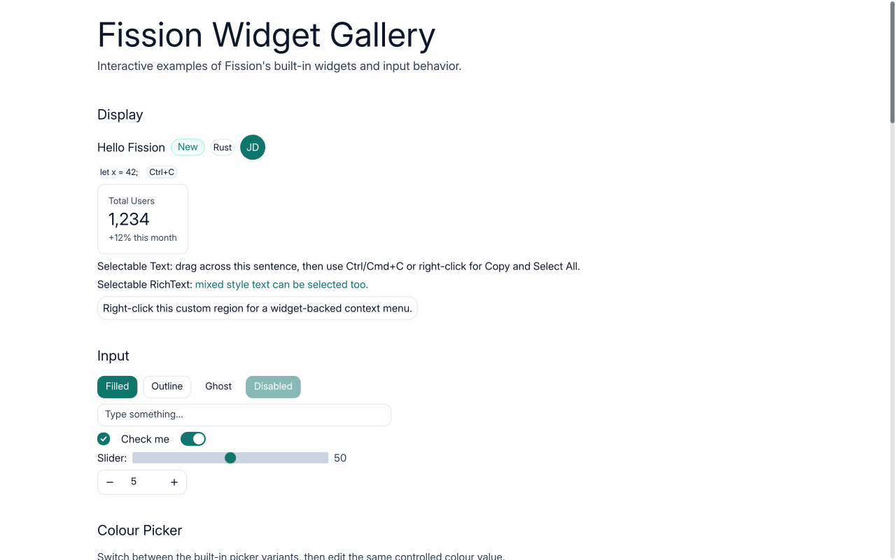
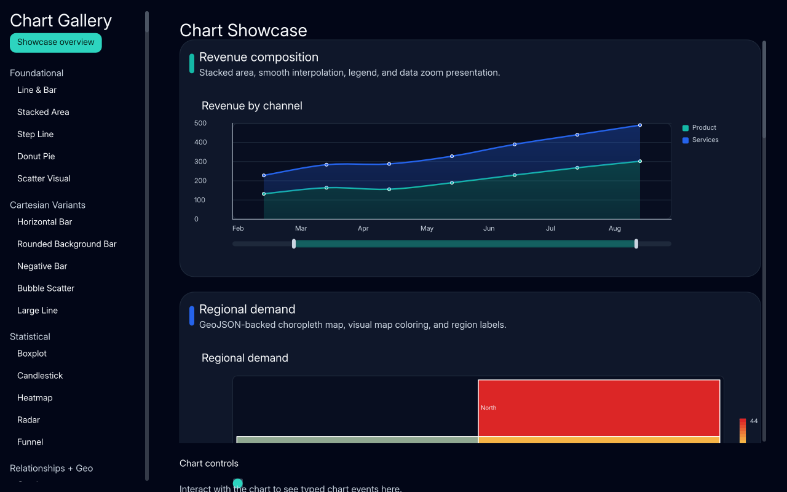
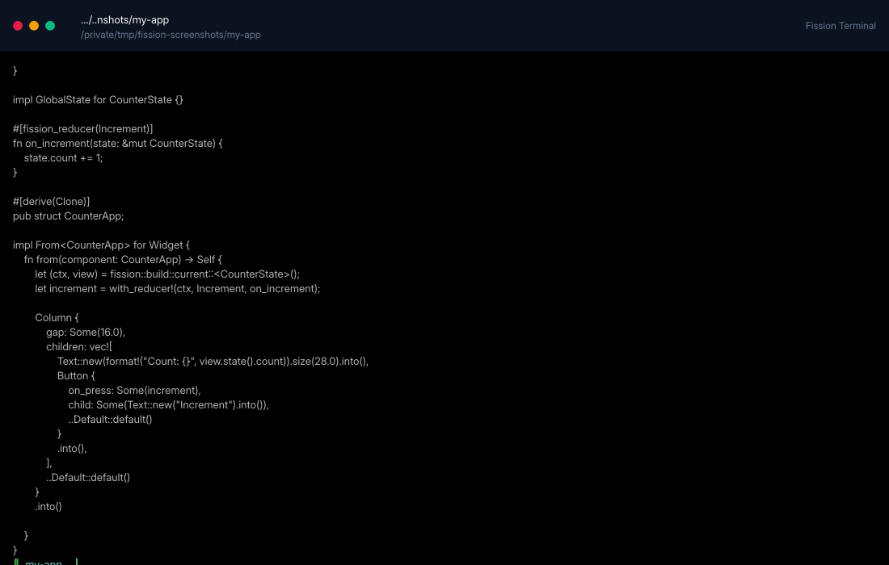
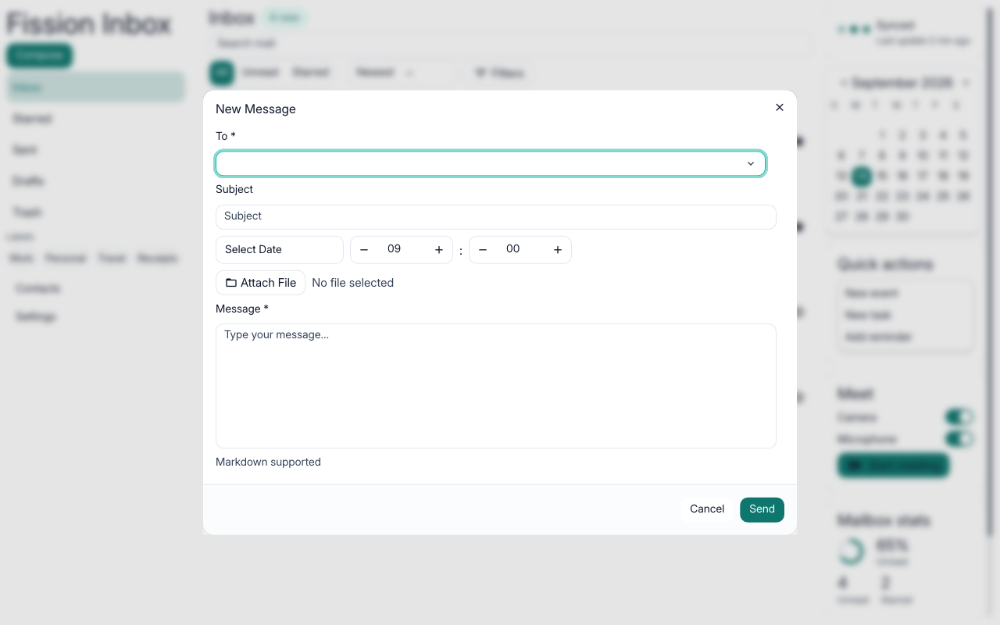
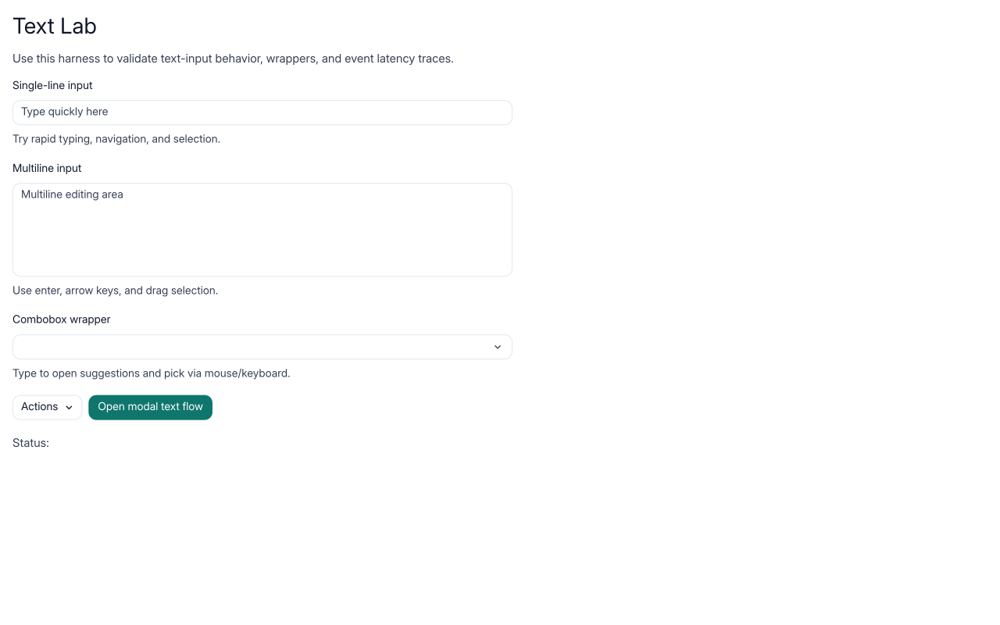

<p align="center">
  
</p>

<h1 align="center">Fission</h1>

<p align="center">
  <strong>One Rust app. Every surface.</strong><br />
  Build desktop, web, mobile, terminal, static-site and server-rendered apps from one Rust codebase,
  with one widget model and one toolchain.
</p>

<p align="center">
  <a href="https://crates.io/crates/fission"></a>
  <a href="https://fission.rs"></a>
  <a href="https://github.com/fission-ui/fission/actions/workflows/platform-checks.yml"></a>
  <a href="LICENSE"></a>
</p>

<p align="center">
  <a href="https://fission.rs/docs/learn/quickstart/">Quickstart</a> ·
  <a href="https://fission.rs">Documentation</a> ·
  <a href="#examples">Examples</a> ·
  <a href="https://fission.rs/crates/">Crates</a>
</p>

<p align="center">
  
</p>

---

## Why Rust teams choose Fission

You already know how to model state, handle errors and test in Rust. Fission lets you use exactly
that to ship user interfaces, instead of maintaining a separate app per platform.

- **One codebase, nine targets.** macOS, Windows, Linux, Web, Android, iOS, Terminal, Static site
  and SSR share the same state, actions and widgets. No JavaScript bridge, no second UI stack.
- **Plain Rust, no DSL.** Widgets are ordinary structs, state is an ordinary type, and updates are
  typed reducers. Your editor, the compiler and `cargo test` understand all of it.
- **Production ready.** Teams already ship products on Fission, and so do we. Accessibility,
  keyboard navigation, text editing, right-to-left layout and focus handling are built in, not
  bolted on.
- **The whole lifecycle, one command.** `fission` creates projects, runs them on devices and
  simulators, tests them, packages them for app stores and publishes releases.
- **GPU rendering with a matching CPU fallback.** Both paths share one renderer, so what you test is
  what you ship.
- **Batteries included.** Over a hundred widgets, charts, design systems (bundled presets or your
  own tokens), animation, media and 3D, platform capabilities such as notifications, biometrics and
  camera, and a test harness that drives real apps.

## Get started in a minute

If you have Rust installed ([rustup.rs](https://rustup.rs) if not), this is all it takes:

```sh
cargo install cargo-fission
fission init my-app
cd my-app
fission run
```

A window opens with a working counter. Here is all of the code behind it:

```rust
use fission::prelude::*;

#[derive(Default, Debug, Clone, PartialEq)]
pub struct CounterState {
    pub count: i32,
}

impl GlobalState for CounterState {}

#[fission_reducer(Increment)]
fn on_increment(state: &mut CounterState) {
    state.count += 1;
}

#[derive(Clone)]
pub struct CounterApp;

impl From<CounterApp> for Widget {
    fn from(_: CounterApp) -> Self {
        let (ctx, view) = fission::build::current::<CounterState>();
        let increment = with_reducer!(ctx, Increment, on_increment);

        Column {
            gap: Some(16.0),
            children: vec![
                Text::new(format!("Count: {}", view.state().count)).size(28.0).into(),
                Button {
                    on_press: Some(increment),
                    child: Some(Text::new("Increment").into()),
                    ..Default::default()
                }
                .into(),
            ],
            ..Default::default()
        }
        .into()
    }
}
```

State is a plain struct, `Increment` is a typed action handled by a plain function, and the UI is a
value built from it. When the state changes, Fission rebuilds the view and updates only what changed.

The same app runs on other targets once you add them:

```sh
fission add-target web android ios
fission run --target web
fission devices
fission run --target android --device <device-id>
```

New to Rust? The [Quickstart](https://fission.rs/docs/learn/quickstart/) walks through installing
the toolchain, the project layout and your first changes step by step.

## See what it builds

Every image below is a checked-in example you can run with `cargo run -p <name>`.

<table>
  <tr>
    <td width="50%"><br /><strong>fission-editor</strong>: a code editor with a file tree, tabs and a terminal</td>
    <td width="50%"><br /><strong>widget-gallery</strong>: every built-in widget, live</td>
  </tr>
  <tr>
    <td><br /><strong>chart-gallery</strong>: line, bar, map, hierarchy and 3D charts</td>
    <td><br /><strong>terminal</strong>: a terminal emulator widget</td>
  </tr>
  <tr>
    <td><br /><strong>inbox</strong>: forms, validation, dialogs and filters</td>
    <td><br /><strong>text-lab</strong>: rich text, selection and editing</td>
  </tr>
</table>

## Targets

| Target | Run it with |
| --- | --- |
| macOS, Windows, Linux | `fission run` (or `cargo run`) |
| Web (WebAssembly) | `fission run --target web` |
| Android | `fission run --target android --device <id>` |
| iOS | `fission run --target ios --device <simulator-id>` |
| Terminal | Terminal widgets in any app, or a terminal-only app |
| Static site | `fission site serve --project-dir <site>` |
| Server-rendered site | `fission server serve --project-dir <app>` |

Some platform capabilities depend on what the host supports; the
[capability matrix](https://fission.rs/docs/guides/platform-capabilities/) lists each one per target.

## Examples

```sh
git clone --recurse-submodules https://github.com/fission-ui/fission
cd fission
cargo run -p counter
cargo run -p inbox
cargo run -p widget-gallery
cargo run -p chart-gallery
cargo run -p fission-editor
```

The documentation site at [fission.rs](https://fission.rs) is itself a Fission static site; its
source is in [`documentation`](documentation).

## Learn more

- [Quickstart](https://fission.rs/docs/learn/quickstart/)
- [App structure](https://fission.rs/docs/guides/app-structure/)
- [Widgets and layout](https://fission.rs/docs/guides/layout-and-widgets/)
- [Design systems](https://fission.rs/docs/guides/design-system/)
- [Charts](https://fission.rs/docs/charts/overview/)
- [Testing](https://fission.rs/docs/test-and-debug/overview/)
- [Build and package](https://fission.rs/docs/build-and-package/overview/)
- [Release and distribute](https://fission.rs/docs/release-and-distribute/overview/)

## Contributing

Fission is open to practical contributions: bug fixes, tests, documentation, examples and platform
work. Read [CONTRIBUTING.md](CONTRIBUTING.md) before opening larger changes.

## License

Apache 2.0. See [LICENSE](LICENSE).
