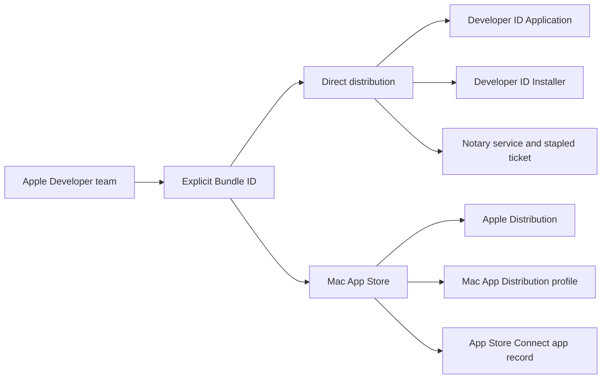

# Set up Apple signing for a Fission app

This guide prepares a macOS project for both direct distribution and the Mac App Store. It assumes you have never shipped a signed Apple application before. Complete it once per Apple Developer team, then use the configuration in [Direct macOS distribution](/docs/cookbook/notarise-macos-direct-distribution/) or [Mac App Store distribution](/docs/cookbook/macos-app-store-distribution/).

## The two release routes

Apple treats these as different products with different trust chains:



The app can keep the same bundle identifier in both routes. The signing identity, provisioning profile, entitlements, packaging policy, and final upload destination change.

## 1. Confirm the Apple team

You need an Apple Developer Program membership, an organisation team, and an Apple Developer role that can manage certificates and identifiers. Record:

- Team ID, for example `A1B2C3D4E5`.
- Organisation name as it appears in certificates.
- Bundle identifier, for example `com.example.product`.
- App Store Connect app ID after the app record exists.

Do not confuse the Team ID with the numeric App Store Connect app ID. The Team ID appears in signing identities and provisioning profiles; the app ID is used by Store Connect APIs.

## 2. Register the explicit Bundle ID

In [Certificates, Identifiers & Profiles](https://developer.apple.com/account/resources/identifiers/list), choose **Identifiers**, add an **App IDs** entry, select **App**, and register the exact identifier used by `CFBundleIdentifier`.

Use an explicit identifier, not a wildcard. Enable only capabilities required by the current release. For a scanner-only macOS app this commonly includes:

- App Groups, if the app and an extension share state.
- Keychain Sharing, if the application uses an access group.
- App Sandbox and file access entitlements appropriate to the app.

Do not enable Endpoint Security or register an Endpoint Security extension until Apple approves the entitlement. A separate extension identifier such as `com.example.product.endpoint-security` is not a second Store app; it is an extension target embedded in the host app later.

## 3. Create the App Store Connect app record

In [App Store Connect](https://appstoreconnect.apple.com/), open **My Apps**, select **+**, choose **New App**, and select **macOS**. Select the Bundle ID you just registered. The record cannot be created through the API.

Fill the store metadata before upload:

- Name and subtitle.
- Promotional text and full description.
- Keywords, support URL, marketing URL, and privacy policy URL.
- Support contact email and review contact information.
- Category, age rating, copyright, and export-compliance answers.
- Review notes explaining what the scanner does and how the reviewer can exercise it.

Keep the app name and bundle identifier stable. The version and build number are changed for each upload; Apple rejects a reused build number.

## 4. Generate a certificate signing request

The private key must stay on the Mac or in your CI secret store. The CSR is the public request Apple uses to issue a certificate.

1. Open **Keychain Access**.
2. Choose **Keychain Access > Certificate Assistant > Request a Certificate From a Certificate Authority**.
3. Enter the Apple-account email address and a recognisable Common Name, such as `Example Mac Release 2026`.
4. Select **Saved to disk** and save the `.certSigningRequest` file.
5. Upload that CSR when Apple asks for it.

The private key created alongside the CSR is what makes the downloaded certificate useful. If the private key is lost, generate a new CSR and certificate rather than trying to recover it from Apple.

## 5. Create the certificates

Create the certificates under **Certificates** in the Apple Developer portal. The exact labels vary slightly between portal revisions; choose the purpose, not merely the nearest name.

| Certificate | Used for | Needed now? |
| --- | --- | --- |
| Apple Development | Local development and `fission run` | Yes for development |
| Developer ID Application | Signing the `.app` for downloads outside the Store | Yes for direct distribution |
| Developer ID Installer | Signing the direct-distribution `.pkg` | Yes for direct distribution |
| Mac App Distribution / Apple Distribution | Signing the Store app | Yes for the Store |
| Mac Installer Distribution / Mac Installer Distribution | Signing the Store installer package | Usually yes for a packaged Store submission |

Download each issued `.cer` file and open it in Keychain Access. Verify it appears with its private key. For CI, select the certificate and its private key together and export a password-protected `.p12` file:

```bash
security find-identity -v -p codesigning
security export \
  -k "$HOME/Library/Keychains/login.keychain-db" \
  -t identities \
  -f pkcs12 \
  -P "$P12_PASSWORD" \
  -o developer-id-application.p12
```

If `security export` is unavailable on your macOS version, use Keychain Access: select the certificate and private key, choose **Export Items**, select `.p12`, and set a strong export password.

Never commit a `.p12`, private key, provisioning profile containing sensitive data, or `.p8` file to the repository.

## 6. Create provisioning profiles

Profiles bind a bundle identifier, team, capabilities, and signing purpose. Create and download separate profiles for separate purposes:

- **Development**: local development and Fission test runs.
- **Developer ID**: direct-distribution app packaging when the project enables a profile for that route.
- **Mac App Store**: the sandboxed Store app.

In **Profiles**, choose the matching profile type, select the explicit Bundle ID, select the certificate, name the profile clearly, and download it. Install a profile locally by opening it or copying it into `~/Library/MobileDevice/Provisioning Profiles/`.

Inspect a profile before putting it in CI:

```bash
security cms -D -i DeveloperDefenceMacAppStore.provisionprofile \
  -o /tmp/profile.plist
plutil -p /tmp/profile.plist
```

The profile must match the bundle ID and team used by the package. A valid certificate with a mismatched profile still produces a signing failure.

## 7. Create the App Store Connect API key

For automated uploads, open **Users and Access > Integrations > Team Keys** in App Store Connect and create a key with **App Manager** or **Admin** access, depending on whether the workflow must mutate metadata and screenshots as well as upload builds.

Download the `.p8` file immediately; Apple only provides the private key once. Record the Key ID and Issuer ID. The `.p8` is a private signing key, not a certificate.

Use the narrower role when the workflow only uploads builds. Use App Manager/Admin when Fission must push listing metadata, screenshots, or submit a release. A key that can upload but cannot mutate listing content will return a provider permission error even though binary upload succeeds.

## 8. Configure local Fission secrets

Keep stable identifiers in `fission.toml` and secrets outside it. A typical local setup uses:

```bash
export APPLE_DEVELOPER_TEAM_ID="A1B2C3D4E5"
export MACOS_DEVELOPER_ID_APPLICATION_IDENTITY="Developer ID Application: Example Ltd (A1B2C3D4E5)"
export MACOS_DEVELOPER_ID_INSTALLER_IDENTITY="Developer ID Installer: Example Ltd (A1B2C3D4E5)"
export APP_STORE_CONNECT_ISSUER_ID="00000000-0000-0000-0000-000000000000"
export APP_STORE_CONNECT_KEY_ID="ABC123DEFG"
export APP_STORE_CONNECT_API_KEY_PATH="$HOME/.private-keys/AuthKey_ABC123DEFG.p8"
```

For CI, the project may additionally need base64-encoded certificates, profiles, and product signing material:

- `MACOS_DEVELOPER_ID_APPLICATION_CERTIFICATE_BASE64` and its password.
- `MACOS_DEVELOPER_ID_INSTALLER_CERTIFICATE_BASE64` and its password.
- `MACOS_SCANNER_PROVISIONING_PROFILE_BASE64`.
- `APP_STORE_CONNECT_API_KEY_BASE64` or a CI-created file from the `.p8` secret.
- The Team ID, Issuer ID, and Key ID as protected variables.

Application-specific release signing keys, embedded intelligence roots, or other product secrets belong in that application's secret store, not in generic Fission documentation or `fission.toml`.

## 9. Add GitHub Actions secrets with the CLI

Authenticate once with a repository that has permission to manage Actions secrets:

```bash
gh auth login
gh secret set MACOS_DEVELOPER_ID_APPLICATION_CERTIFICATE_BASE64 \
  --repo example/product < <(base64 < developer-id-application.p12)
gh secret set MACOS_DEVELOPER_ID_APPLICATION_CERTIFICATE_PASSWORD \
  --repo example/product
gh secret set APP_STORE_CONNECT_API_KEY_BASE64 \
  --repo example/product < <(base64 < AuthKey_ABC123DEFG.p8)
gh variable set APPLE_DEVELOPER_TEAM_ID \
  --repo example/product --body A1B2C3D4E5
gh variable set APP_STORE_CONNECT_ISSUER_ID \
  --repo example/product --body 00000000-0000-0000-0000-000000000000
gh variable set APP_STORE_CONNECT_KEY_ID \
  --repo example/product --body ABC123DEFG
```

The interactive `gh secret set NAME --repo OWNER/REPO` form is safer for passwords because the value is not placed in shell history. In the GitHub UI, use **Settings > Secrets and variables > Actions**, then add the same values as repository secrets or variables. Restrict environments and reviewers for production signing.

## 10. Verify before building

Run these checks on the Mac that will package the app:

```bash
xcode-select --install # only if the command-line tools are absent
security find-identity -v -p codesigning
fission signing inspect --project-dir .
fission release-config validate --project-dir . --provider app-store
```

The direct distribution and Store guides explain the build commands and the provider-specific checks. Keep the two profiles, identities, and entitlements visibly separate so a successful local development build cannot be mistaken for a releasable artifact.

## Further reading

- [Fission macOS packages](/docs/build-and-package/macos-packages/)
- [Fission release lifecycle](/docs/release-and-distribute/post-build-lifecycle/)
- [Apple certificates](https://developer.apple.com/help/account/create-certificates/)
- [Apple provisioning profiles](https://developer.apple.com/help/account/provisioning-profiles/)
- [App Store Connect API keys](https://developer.apple.com/help/app-store-connect/manage-api-access/create-api-keys-for-app-store-connect-api/)
- [Apple certificate signing requests](https://developer.apple.com/help/account/create-certificates/create-a-certificate-signing-request/)
