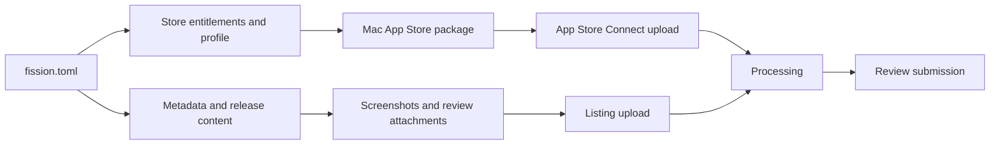

# Ship a macOS app through the App Store

The Mac App Store route uses Store signing and App Store Connect. It is separate from [direct notarised distribution](/docs/cookbook/notarise-macos-direct-distribution/), even when both routes use the same bundle identifier. Start with [Apple signing setup](/docs/cookbook/apple-signing-setup/) to create the team assets.

## Store release flow



## 1. Configure the Store package

The exact identity names vary by Apple account, but the configuration shape is stable:

```toml
[package.macos.variants.app-store]
entitlements = "platforms/macos/AppStore.entitlements"
provisioning_profile = ".fission/signing/macos/DeveloperDefenceMacAppStore.provisionprofile"
signing_identity = "Apple Distribution"
installer_identity = "Mac Installer Distribution"
features = ["macos-app-store"]

[distribution.app_store]
app_id = "1234567890"
bundle_id = "com.example.product"
issuer_id = "00000000-0000-0000-0000-000000000000"
key_id = "ABC123DEFG"
api_key_env = "APP_STORE_CONNECT_API_KEY_PATH"
default_track = "app-store-review"
```

What each block means:

- `package.macos.variants.app-store` selects a Store-specific package variant.
- `entitlements` must describe the sandboxed Store application, not the direct-download app.
- `provisioning_profile` must be the Mac App Store profile for the exact bundle ID.
- `signing_identity` signs the application for Store submission.
- `installer_identity` signs the package format used by the submission flow.
- `features` lets the Rust application remove capabilities that are unavailable in the Store sandbox.
- `distribution.app_store` identifies the existing Store Connect app and API credentials.
- `default_track` makes the intended follow-up explicit; upload, TestFlight, and App Review are different operations.

Secrets stay in the environment or CI. Do not put the `.p8` bytes, certificate passwords, or private keys in `fission.toml`.

## 2. Define release metadata as files

Keep the root TOML compact and put long text in referenced files:

```toml
[[releases]]
version = "1.0.0"
build = 1
metadata = "release-content/metadata/1.0.0/release.toml"
release_notes = "release-content/metadata/1.0.0/notes"
review = "release-content/metadata/1.0.0/review.toml"
privacy = "release-content/metadata/1.0.0/privacy.toml"

[release_content.app_store]
content_output_dir = "release-content"
screenshot_sets_dir = "release-content/screenshots/rendered/app-store"
app_previews_dir = "release-content/previews/app-store"
review_attachments = ["release-content/review/demo.pdf"]
```

This separation lets a content-only correction be reviewed and pushed without changing signed application bytes. It also gives Fission a stable place to hash every submitted asset and write a receipt.

## 3. Prepare screenshots and app previews

Run the app at a deterministic window size and capture the states that explain the product quickly. A useful set usually includes the first-run screen, the primary result, and one detailed view. Do not submit screenshots containing debug controls, fake data, or personal information.

```bash
fission release-content capture \
  --project-dir . \
  --target macos \
  --set app-store

fission release-content render \
  --project-dir . \
  --provider app-store

fission release-content validate \
  --project-dir . \
  --provider app-store
```

The capture configuration belongs in the project release-content settings. A representative shape is:

```toml
[release_content.capture.app_store]
target = "macos"
locale = "en-US"
window_width = 1440
window_height = 900
scenarios = [
  "dashboard-ready",
  "scanner-findings",
  "finding-detail",
]
output_dir = "release-content/screenshots/raw/app-store"
```

The fields have deliberately boring names:

- `target` selects the real Fission shell used for the capture.
- `locale` selects the listing language.
- `window_width` and `window_height` make captures repeatable instead of depending on the developer's current window.
- `scenarios` names deterministic LiveTest or fixture flows that the app exposes for capture.
- `output_dir` keeps raw captures separate from provider-shaped rendered assets.

The exact capture keys available in a particular Fission release should be checked with `fission release-content --help` and the active config reference. The principle is the same: capture real UI states, render them into provider-required sizes, then validate before upload.

## 4. Authenticate App Store Connect

Use an App Store Connect API key with a role that can perform the intended operation. Upload-only workflows may use a narrower role; metadata, screenshots, and submission need an App Manager or Admin-level key.

```bash
export APP_STORE_CONNECT_ISSUER_ID="00000000-0000-0000-0000-000000000000"
export APP_STORE_CONNECT_KEY_ID="ABC123DEFG"
export APP_STORE_CONNECT_API_KEY_PATH="$HOME/.private-keys/AuthKey_ABC123DEFG.p8"
```

Check that the local project and provider agree before uploading:

```bash
fission release-config validate --project-dir . --provider app-store
fission release-config version-state --project-dir . --provider app-store --target macos --json
fission readiness release --project-dir . --provider app-store --target macos --format pkg
```

If build upload works but metadata or screenshot push returns `FORBIDDEN_ERROR`, the API key is valid but underprivileged for that mutation. Create or select a key with the required App Store Connect role; do not weaken the signing or retry blindly.

## 5. Package and upload the build

```bash
fission package \
  --project-dir . \
  --target macos \
  --format pkg \
  --release

fission distribute \
  --project-dir . \
  --provider app-store \
  --artifact target/fission/release/macos/pkg/artifact-manifest.json \
  --track app-store-review \
  --yes
```

The package manifest connects the uploaded bytes to the release version and build. Fission should report the provider build identifier and processing state in its receipt. Wait for Apple processing before assigning the build or submitting it for review.

## 6. Push listing content

Import provider state before overwriting anything, review the diff, and lock the baseline:

```bash
fission release-config import --project-dir . --provider app-store --locales en-US --yes
fission release-config diff --project-dir . --provider app-store
fission release-config lock --project-dir . --provider app-store --locales en-US --yes
```

Then validate and push metadata and release content explicitly:

```bash
fission release-config push \
  --project-dir . \
  --provider app-store \
  --locales en-US \
  --yes

fission release-content push \
  --project-dir . \
  --provider app-store \
  --yes
```

App Store Connect may require the app record to be created manually and may expose different permissions for binary upload, listing mutation, and review submission. Treat each receipt and provider status as a separate checkpoint.

## 7. Submit for review

Before review, confirm:

- The correct Store build is selected for the version.
- Screenshots show the submitted build and contain no debug-only UI.
- Privacy answers and export compliance are complete.
- Support, marketing, and privacy URLs resolve over HTTPS.
- Review notes explain how to reach the useful feature without requiring unavailable credentials.
- The app does not claim capabilities that are absent from the Store build.

Submit only after provider-side processing and release-content validation succeed. Keep review submission separate from upload so a failed listing update cannot accidentally submit an incomplete version.

## 8. CI checklist

- [ ] macOS runner has the required Xcode command-line tools.
- [ ] Store certificate and provisioning profile are imported into an isolated keychain.
- [ ] App Store Connect `.p8` is written to a temporary file.
- [ ] Team ID, issuer ID, and key ID come from protected variables.
- [ ] Build numbers advance monotonically.
- [ ] `fission readiness release` passes before the expensive upload.
- [ ] Artifact, content, and provider receipts are retained.
- [ ] Temporary certificates, profiles, and API keys are deleted after the job.

## Further reading

- [Fission app-store distribution](/docs/release-and-distribute/app-stores/)
- [Fission release content](/docs/release-and-distribute/release-content/)
- [Fission macOS packages](/docs/build-and-package/macos-packages/)
- [Fission live UI tests](/docs/cookbook/write-a-live-ui-test/)
- [Apple App Store Connect API](https://developer.apple.com/documentation/appstoreconnectapi)
- [Apple upload builds overview](https://developer.apple.com/help/app-store-connect/manage-builds/upload-builds-overview/)
