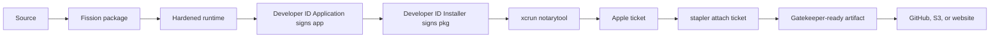

# Notarise a macOS app for direct distribution

Use this route when users download a `.pkg` or `.app` from your website, GitHub Releases, S3, or another distribution host rather than the Mac App Store. Start with [Apple signing setup](/docs/cookbook/apple-signing-setup/) if the certificates and profiles do not exist yet.

## What the finished pipeline proves



Notarisation is not the same as signing. Signing identifies the publisher and protects integrity. Notarisation records Apple's automated malware review result. Stapling embeds the ticket so the first launch does not depend entirely on a network lookup.

## 1. Keep the project configuration declarative

The exact schema depends on the Fission version. The important shape is:

```toml
[package.macos.release]
entitlements = "platforms/macos/DeveloperDefenceScanner.entitlements"
provisioning_profile = ".fission/signing/macos/DeveloperDefenceScanner.provisionprofile"
signing_identity = "Developer ID Application"
installer_identity = "Developer ID Installer"
notarize = true

[distribution.github_releases.production]
owner = "example"
repo = "product"
tag_prefix = "v"
```

Each block has one job:

- `entitlements` declares the capabilities embedded in the app signature.
- `provisioning_profile` points to the profile Fission should pair with the app.
- `signing_identity` selects the Developer ID Application identity from the keychain.
- `installer_identity` selects the Developer ID Installer identity for the outer package.
- `notarize` enables the `notarytool` and stapling stage.
- `distribution.github_releases` describes a destination, not a signing input.

Do not put passwords, API private keys, or `.p12` contents in this file. Fission resolves secrets from the environment, CI secret store, or its configured credential provider.

## 2. Prepare both CPU variants

Run the same release configuration on Apple Silicon and Intel hardware, or use separately provisioned macOS runners. A cross-compiled binary is not automatically a valid native package; confirm that every native dependency and signing step targets the intended architecture.

```bash
fission readiness package \
  --project-dir . \
  --target macos \
  --format pkg \
  --release

fission package \
  --project-dir . \
  --target macos \
  --format pkg \
  --release
```

Fission writes an artifact manifest beside the package. Treat that manifest as the source of truth for the exact path, architecture, hashes, signing state, and notarisation receipt.

## 3. Verify locally before submitting

Use Apple's tools to inspect the result:

```bash
pkgutil --check-signature path/to/product.pkg
spctl --assess --type install --verbose=4 path/to/product.pkg
codesign --verify --deep --strict --verbose=4 path/to/Product.app
xcrun stapler validate path/to/Product.app
```

For a package containing an app, inspect the nested app as well as the outer installer. A package can be signed while its nested executable is not signed correctly.

## 4. Authenticate to Apple notarisation

The recommended non-interactive credential is an App Store Connect API key. Fission can use the same `.p8` key created for Store Connect upload when the key role permits the requested operation:

```bash
export APP_STORE_CONNECT_ISSUER_ID="00000000-0000-0000-0000-000000000000"
export APP_STORE_CONNECT_KEY_ID="ABC123DEFG"
export APP_STORE_CONNECT_API_KEY_PATH="$HOME/.private-keys/AuthKey_ABC123DEFG.p8"
```

An Apple ID app-specific password can also be used with `notarytool`, but it is tied to an individual account and is harder to operate safely in CI. Prefer an API key for a team-owned release pipeline.

To diagnose Apple tooling independently of Fission:

```bash
xcrun notarytool history \
  --key "$APP_STORE_CONNECT_API_KEY_PATH" \
  --key-id "$APP_STORE_CONNECT_KEY_ID" \
  --issuer "$APP_STORE_CONNECT_ISSUER_ID"
```

## 5. Let Fission submit and staple

The package command invokes the configured platform tools. Do not upload the unsigned output by hand after a failed notarisation step. Fix the first failing stage, rebuild if the signed bytes changed, and keep the resulting manifest and receipt together.

```bash
fission package \
  --project-dir . \
  --target macos \
  --format pkg \
  --release
```

On success, validate the artifact again. The expected evidence is:

- Developer ID Application signature on the app.
- Developer ID Installer signature on the package.
- Hardened runtime enabled where required by the app.
- Notary submission accepted.
- Ticket stapled to the app or package.
- Independent `codesign`, `spctl`, `pkgutil`, and `stapler` checks pass.

## 6. Publish without reprocessing the bytes

Fission can publish the exact manifest-backed artifact to multiple providers. GitHub Releases is convenient for a first public release; S3-compatible object storage is useful when you own the download domain and cache policy.

```bash
fission distribute \
  --project-dir . \
  --provider github-releases \
  --artifact target/fission/release/macos/pkg/artifact-manifest.json \
  --deploy v1.0.0

fission distribute \
  --project-dir . \
  --provider s3 \
  --artifact target/fission/release/macos/pkg/artifact-manifest.json
```

Other supported destinations include GitHub Pages, Cloudflare Pages, Netlify, Google Drive, OneDrive, and Dropbox where the artifact type and provider configuration are appropriate. See [GitHub Releases](/docs/release-and-distribute/github-releases/), [object storage](/docs/release-and-distribute/object-storage/), and [distribution overview](/docs/release-and-distribute/overview/).

If a website proxies GitHub or object storage, it should stream the immutable release asset and preserve its content length and checksum. It should not unpack and rebuild the package in the request path.

## 7. Automate it in GitHub Actions

Use a macOS runner for Apple signing and notarisation. Import the base64 `.p12` files into a temporary keychain, install the provisioning profile, write the `.p8` key to a temporary file, run Fission, and delete temporary credentials in a cleanup step.

```yaml
- name: Package notarised macOS installer
  env:
    APPLE_DEVELOPER_TEAM_ID: ${{ vars.APPLE_DEVELOPER_TEAM_ID }}
    APP_STORE_CONNECT_ISSUER_ID: ${{ vars.APP_STORE_CONNECT_ISSUER_ID }}
    APP_STORE_CONNECT_KEY_ID: ${{ vars.APP_STORE_CONNECT_KEY_ID }}
    P12_PASSWORD: ${{ secrets.MACOS_P12_PASSWORD }}
  run: scripts/ci/package-macos.sh

- name: Publish release
  run: >-
    fission distribute --project-dir .
    --provider github-releases
    --artifact target/fission/release/macos/pkg/artifact-manifest.json
    --deploy "v${{ github.ref_name }}"
```

Pin the Fission version or revision used by the project, record the artifact manifest, and make replacement of an existing GitHub asset explicit. Never use `--clobber` as an accidental retry policy.

## 8. Release checklist

- [ ] ARM and Intel artifacts were built from the intended commit.
- [ ] Each app has the expected bundle ID and Team ID.
- [ ] Nested code and the outer package verify.
- [ ] Notary status is `Accepted`.
- [ ] The ticket is stapled and validates offline.
- [ ] The release asset hash matches the artifact manifest.
- [ ] A clean Mac can download, install, launch, and remove the app.
- [ ] The release page includes checksums and a support path.

## Further reading

- [Fission macOS packages](/docs/build-and-package/macos-packages/)
- [Fission release lifecycle](/docs/release-and-distribute/post-build-lifecycle/)
- [Fission GitHub Releases](/docs/release-and-distribute/github-releases/)
- [Fission object storage](/docs/release-and-distribute/object-storage/)
- [Apple notarising macOS software](https://developer.apple.com/documentation/security/notarizing_macos_software_before_distribution)
- [Apple `notarytool`](https://developer.apple.com/documentation/security/notarizing_macos_software_before_distribution/customizing-the-notarization-workflow)
